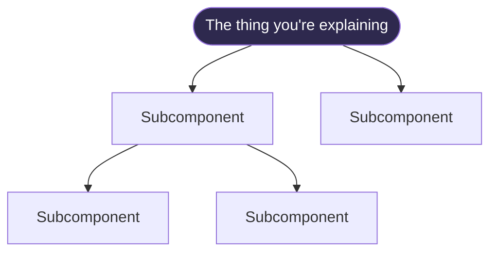
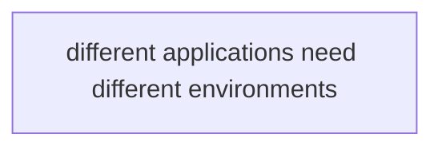
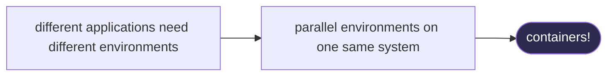
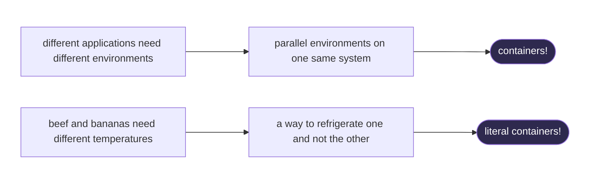
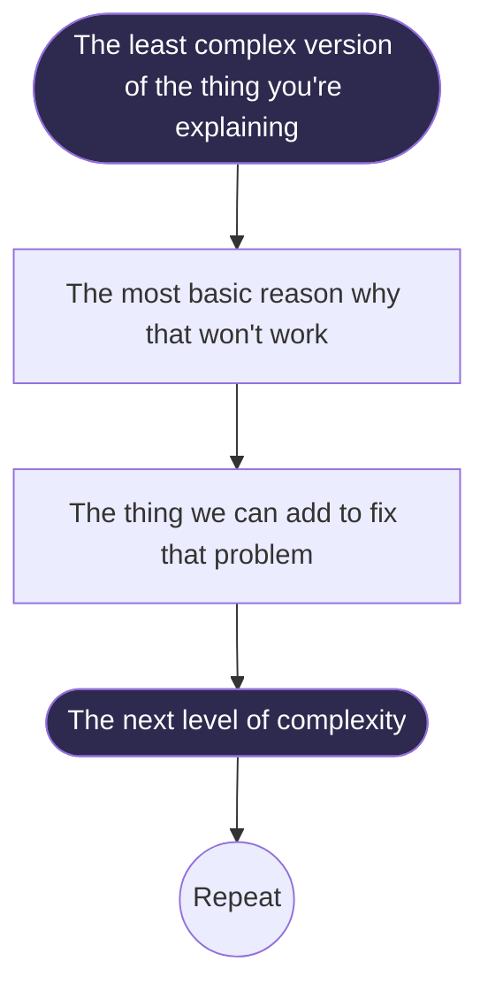
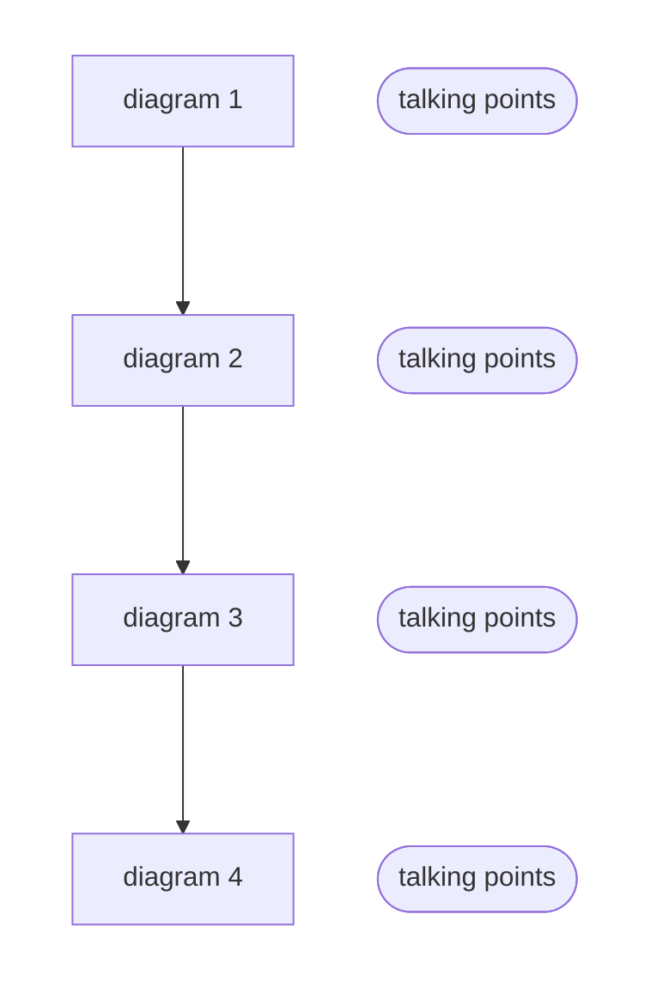

+++
draft = true
date = '2026-07-15'
title = "How to Make a Tech Explainer That's Actually Good"
css = ["canonitech.css"]
blurb = "Three principles for teaching tech concepts to non-tech people"
thumbnail = "net-positive-D1.png"
+++

When I was on the design team at Canonical, I developed a kind of reputation as the "tech explainer" guy. While most of my colleagues had pure design backgrounds, and needed to learn all of their linux concepts from scratch after joining the company, I had been a linux nerd long before I was a designer, and I spent my first year at Canonical working in the technical support team. This meant that when designers needed to create an interface for some advanced feature of their product, they would often come to me for help wrapping their heads around some of the underlying concepts.

During one of the company conferences, I wrote and presented a short technical explainer for the design team, explaining the basics of Git. The talk was so popular that I was placed in charge of a working group that would write and present four more.

Over the course of writing these workshops (which were nicknamed Canonitech), I identified a set of principles that I think are critical for making a technical explanation informative and easy to follow. I now present to you 3 principles according to my own experience:

<table class="summary-table">
  <tbody>
    <tr>
      <th></th>
    </tr>
      <tr>
          <td scope="row"><a href="#p1">Problem → Solution</a></td>
          <td>Instead of diving right into the weeds, explain what problem your current topic solves.</td>
      </tr>
      <tr>
          <td scope="row"><a href="#p2">Naive → Informed</a></td>
          <td>Build up your topic from its most basic principles, using ‘Problem → Solution’ to motivate each jump in complexity</td>
      </tr>
      <tr>
          <td scope="row"><a href="#p3">Diagrams &gt; Words</a></td>
          <td>Visual aides are not supplemental. They are the backbone of a good explanation.</td>
      </tr>
  </tbody>
</table>

## 1. Problem → Solution {#p1}

**The basic structure of your technical explainer should be a description of a problem, and how the topic you're explaining solves that problem**

Too often, an explainer will start by explaining how something works, without first explaining what that thing is for.

This is an easy mistake to make, because when someone asks you to explain something, it's often something like:

> What are containers?

To which the natural response might be

> Containers are a way of encapsulating an operating system within another operating system, similar to a virtual machine, except the container shares the kernel of the host. So it's more lightweight.

In other words, our first instinct, when asked to explain a technical concept, is to start with the thing we're explaining, and break it down into its component parts.

We do this because, as the person who understands the thing at a deeper level, this is how we understand it.

The problem is that this is very hard to follow. If you're already familiar with containers, the explanation above might seem simple and correct. But to someone who doesn't yet know what containers are, you're just reciting a list of other things that they don't understand, and and expecting them to understand them all simultaneously.

For an introductory explanation, you need to tell some kind of story. And in most cases, that story takes the form of a problem in search of a solution, where that solution is the thing you're explaining.

So, back to the containers example. Instead of jumping right into what containers are, we first explain the problem:

> Infrastructure applications need specific packages and system configurations to be present in order to work properly. This is called their "environment". But two different applications might have two incompatible environments, which means they won't work well if they're installed on the same system.

Then we introduce a solution:

> So what you can do is set up an application's environment inside of something called a "container", which runs on a host system. A host can run any number of containers, each with its own environment, and none of those environments will conflict with each other.

And for extra points, you can go back to the beginning and retell the whole story, from problem to solution, using a metaphor:

> Think of it like you're a transport ship. One customer wants to transport frozen beef, another customer wants to transport bananas. If you install refrigeration throughout your ship so that the beef stays cold, you'll ruin the bananas. So what you do is you only install the refrigeration in the container with the beef, and not in the container with the bananas.

## 2. Naive → Informed {#p2}

**Build up your topic from its most basic principles, using ‘Problem → Solution’ to motivate each jump in complexity**

Some things are implemented in what seems like an overly complicated way. For example, when people learn about Git, they get tripped up by the seemingly overlapping concepts of changes, commits, branches, tags, and forks. Why can't developers just work out of a shared dropbox folder?

In cases like this, it's important to build up the concept, layer by layer, starting with the most naive possible version of the thing you're explaining. Each time you go up a level in complexity, motivate it using the same problem → solution framework that I talked about in the first section:

This is something that a lot of experts struggle with, because they forget what it's like to not know the things that they know.

So in the Git example, start by imagining that you have something like a synced dropbox folder with your software project in it. Now invite the audience to imagine what would happen if developer A wants to start building a new feature, at the same time that developer B is trying to fix a bug somewhere else in the code. When developer B runs their code, it will crash because there's unfinished feature code from developer A. This is why Git lets you create branches, where each piece of work in progress is isolated from the others until it's finished and merged.

## 3. Diagrams > Words {#p3}

**Visual aides are not supplemental. They are the backbone of a good explanation.**

I'll admit that this last point might be a bit of a matter of personal style. But for me, it's extremely important to take your visual aides seriously.

Humans are basically very smart monkeys. We *can* understand abstract concepts if we really need to, but we're not good at it. We're much better at understanding physical objects with physical shapes and properties. That's why if you sit down to explain something complicated to someone, like a computer network, you quickly find yourself saying "hang on, let me grab a piece of paper" so that you can draw a network diagram.

What I want to drive home is that, if the person you were giving the explanation to walked away understanding what you taught them, they didn't understand the topic *with the help of the diagram*. They understood the diagram *as the topic*.

Therefore you should take diagrams extremely seriously. Diagrams are so important to my technical explainers that they're the first thing I make while planning the explainer. I usually start by sketching out diagrams by hand or in an online whiteboard, and my sequence of diagrams becomes my central outline for the lecture.

## Conclusion

My Canonitech lectures were a huge success. Each one had great attendance, and I always had a lot of insightful questions that showed me that people were hanging on every word. In conversations, when other hard technical topics came up, people would say "We need a Canonitech on that!"

For designers, understanding the technology behind the product you're designing is extremely valuable.

- It streamlines your conversations with your engineering team, because you have a shared mental model
- It saves you time, because you don't waste time ideating features that aren't possible
- It accelerates your work, because you don't need to spend each design project decoding and memorizing the engineering brief.

But in my experience, a lot of designers feel too embarrassed to ask the basic questions that would give them a deeper understanding. If you're an engineer, put yourself in their shoes. Remember when you didn't know anything about the field you work in, and everyone seemed so smart, and you felt like you couldn't ask questions because people would think you were a fraud.

The principles I laid out in this article, and many other lessons I've learned while making tech explainer presentations, support the basic truth that every adult who needs something explained to them wants you to explain it to them like they're 5, but without treating them like they're 5. Among other things, that means: break everything down to the very basics, anticipate the "stupid" questions and answer them before your audience has to, and please, just draw some damn pictures.

The challenge, I think, in truly explaining something to someone like they're 5, comes from the fact that the experts are just as insecure as the people who don't know anything. "If I don't explain this at the level of an absolute expert, then maybe people won't treat me like an expert!" But when you can meet people where they are, and acknowledge that it's ok not to know this stuff yet, you don't just educate them more effectively, you also make them more confident in themselves.

