+++
date = '2026-05-11'
title = 'Redesigning Notifications for LXD'
blurb = "A perfect case study in what makes UX design a separate discipline from visual design"
thumbnail = "notification-drawer-3.jpg"
+++

Back in 2024, I was tasked with overhauling the notification experience within LXD UI. The notifications themselves looked visually fine, but the experience of when they appeared and how one interacted with them was terrible.

The process of redesigning them taught me a lot about UX, and I think it's a great case study of what makes UX design a distinct discipline from visual design.

## Notifications in LXD

If you're not familiar with LXD, it's a hypervisor for containers and virtual machines that runs on Linux. As well as a traditional command line interface, LXD also has a UI that runs in the browser. The UI allows users to carry out actions like creating, starting, and stopping their containers and virtual machines, as well as managing other virtualization resources inside of LXD.

To give feedback that an action had failed or succeeded, and to advise a user of other changes of state, LXD would frequently use onscreen notifications. On the surface, LXD's notifications *looked* fine, by which I mean they had a perfectly nice-looking React component that matched our brand guidelines. The problem was where they appeared, when they appeared, and how they behaved when you interacted with them.

In otherwords, this was strictly a *user experience* problem, not a visual design problem.

### Improved use of space

<figure>
  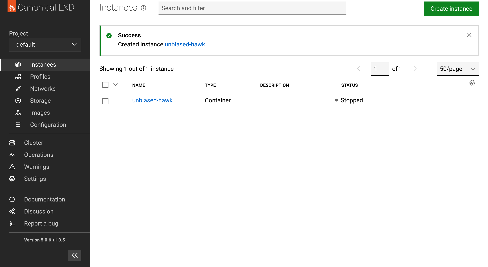
  <figcaption>What notifications looked like before the redesign</figcaption>
</figure>

Before this redesign, notifications took up the whole width of the page, and appeared inline with the main page content. So when notifications appeared, they would push down all of the content below them.

This meant that if you had been about to click something when a notification appeared, you might accidentally click something else.

The fix for this was pretty simple, and is common in many user interfaces you're familiar with: when a notification appears, it should "float" over the page content in an unobtrusive location onscreen, and not take up too much space. I put them in the bottom right corner of the UI.


  <figure>
    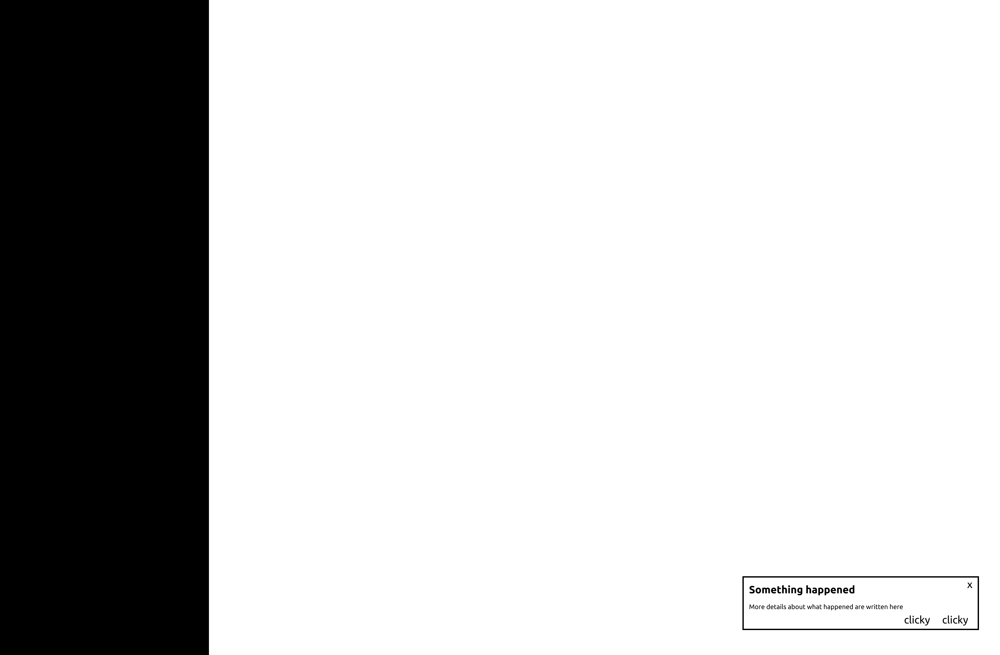
    <figcaption>Wireframe</figcaption>
  </figure>
  <figure>
    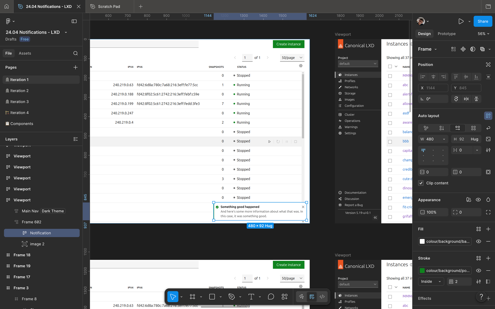
    <figcaption>Intermediate design</figcaption>
  </figure>
  <figure>
    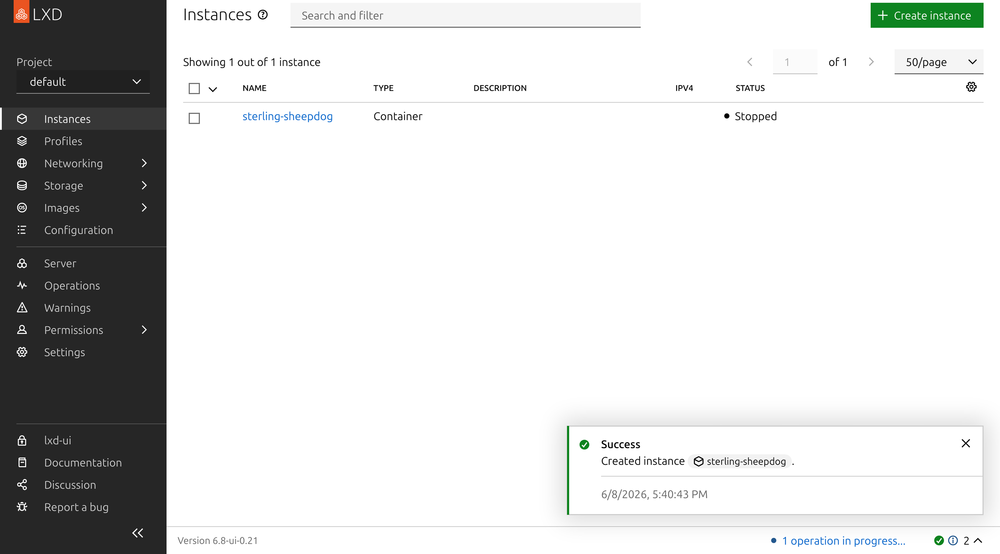
    <figcaption>Final live UI</figcaption>
  </figure>


### Retrievability

The other problem with the notifications we used to have, was that if two notifications appeared in quick succession, the second one would immediately dismiss the previous one, and it was impossible to retrieve. If there had been important information on that previous notification, it would be gone forever.

At first, I experimented with allowing more than one notification to stack up in the corner. But this created a new problem, which was that if the notifications piled up arbitrarily high, they could block the important UI elements that often appear in the upper right of the screen.

<figure>
  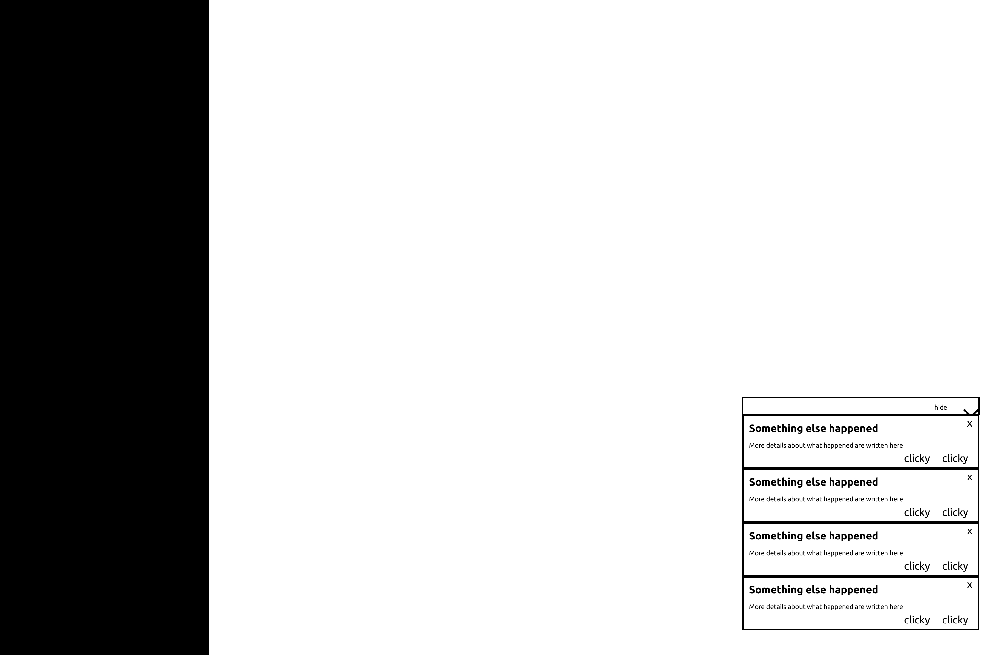
  <figcaption>Early mockup of stacking notifications</figcaption>
</figure>

So I ended up deciding to keep this clobbering behaviour. To make it so that a user could retrieve messages they didn't have time to read, I created a notification drawer that lived in the page footer.

When a notification is hidden, but before it's fully "dismissed", it lives in the notification drawer. If you want to dismiss all of your notifications, the notification drawer has a button that lets you do that in one click.


  <figure>
    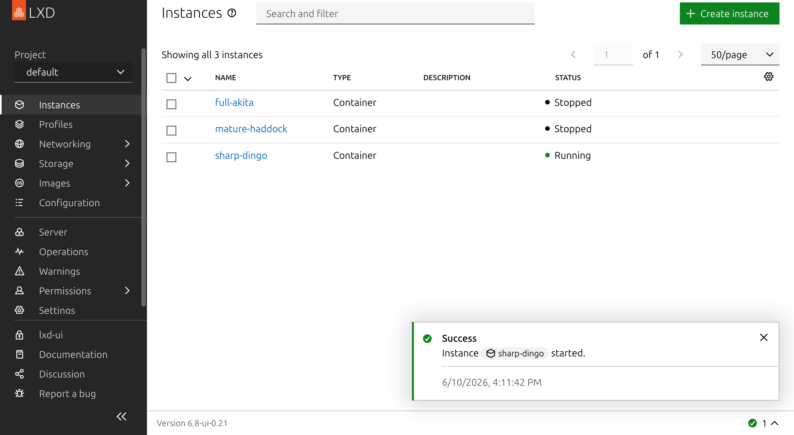
    <figcaption>A notification appears onscreen...</figcaption>
  </figure>
  <figure>
    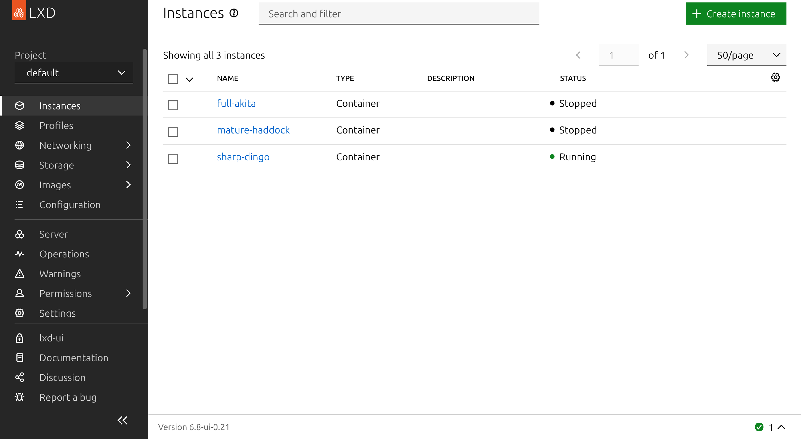
    <figcaption>...and then hides after a couple seconds...</figcaption>
  </figure>
  <figure>
    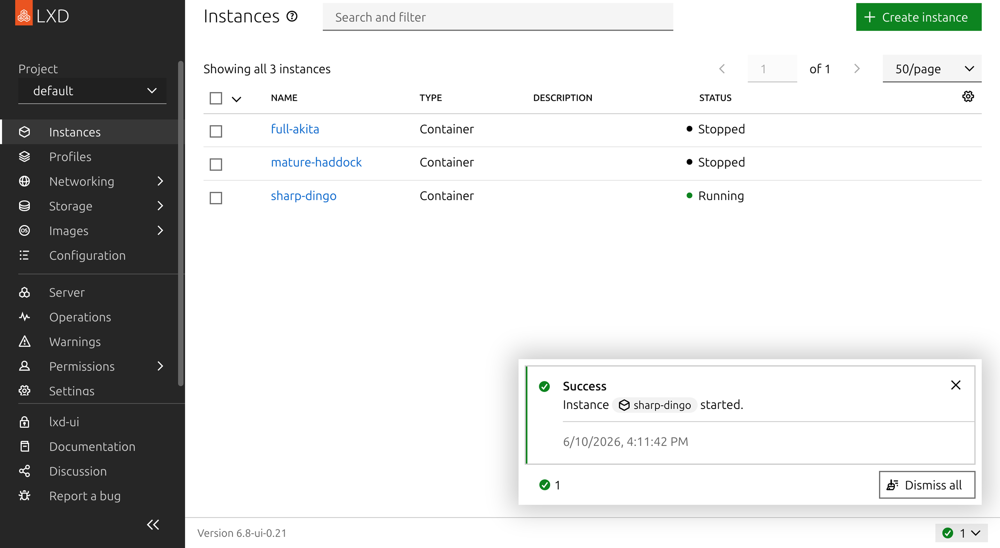
    <figcaption>...but it can still be found in the notification drawer</figcaption>
  </figure>


### Organization

But now that I had a place where notifications could pile up indefinitely, I needed to make sure they didn't become too overwhelming. LXD notifications already had 4 different modes: information, warning, error, and success. I created a filter that allowed the user to show only notifications of a given mode, and dismiss them all at once.


<figure>
  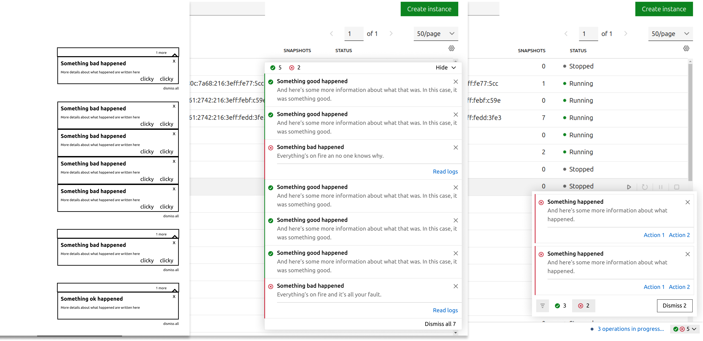
  <figcaption>Early iterations of the notification drawer</figcaption>
</figure>
<figure>
  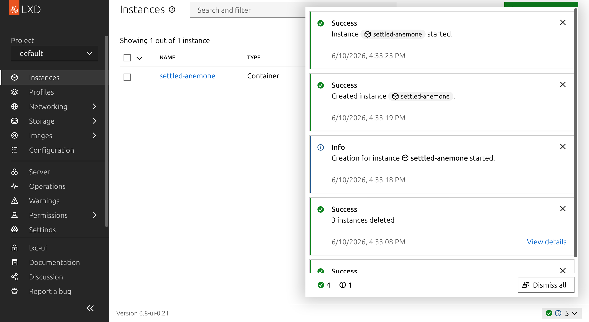
  <figcaption>
    The final UI
  </figcaption>
</figure>
<figure>
  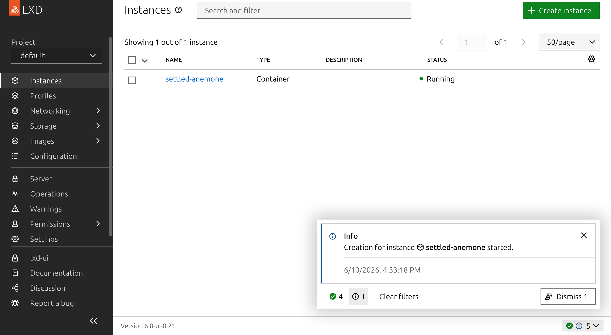
  <figcaption>
    Notifications can be filtered and bulk-dismissed with buttons at the bottom of the drawer.
  </figcaption>
</figure>


## Thoughts

Notice that in this whole "notification redesign", I didn't change the way notifications look at all. In terms of their layout, colours, and typography, the notifications looked exactly the same at the beginning of the project as at the end.

And even though I designed a brand new component, all of the "designery" decisions, like font, colours, and iconography, button sizes, were all decisions made by someone else before I ever started this project.

Despite this, the experience of using LXD and interacting with notifications was completely transformed after this redesign. Not no much in terms of how the UI looks, but in terms of what it's like to use it. The page content no longer jumps around awkwardly whenever something changes. The feeling of being shown some text but not being allowed to read it is gone. It system allows you to interact with it more on your own terms than before.

This is a concrete example of what I try to explain when I talk to people who don't know what UX design is: It's not about aesthetics, it's about usability.
