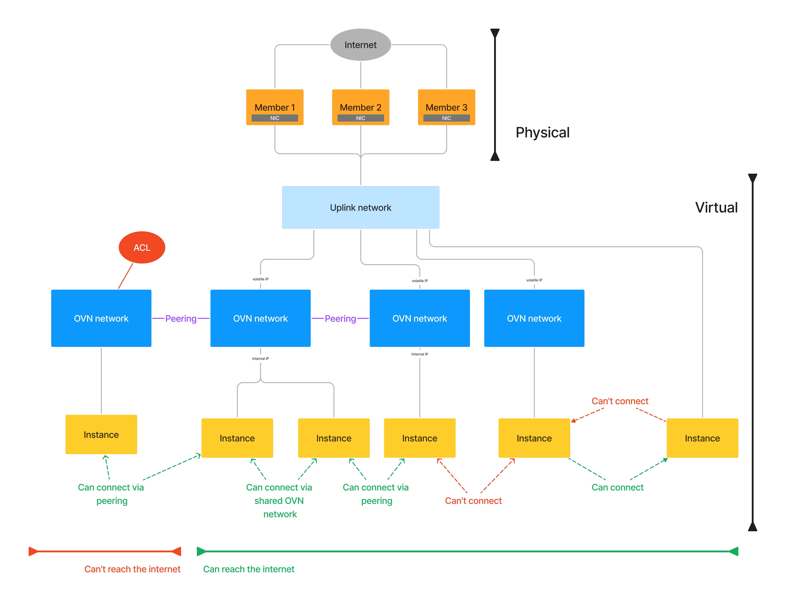
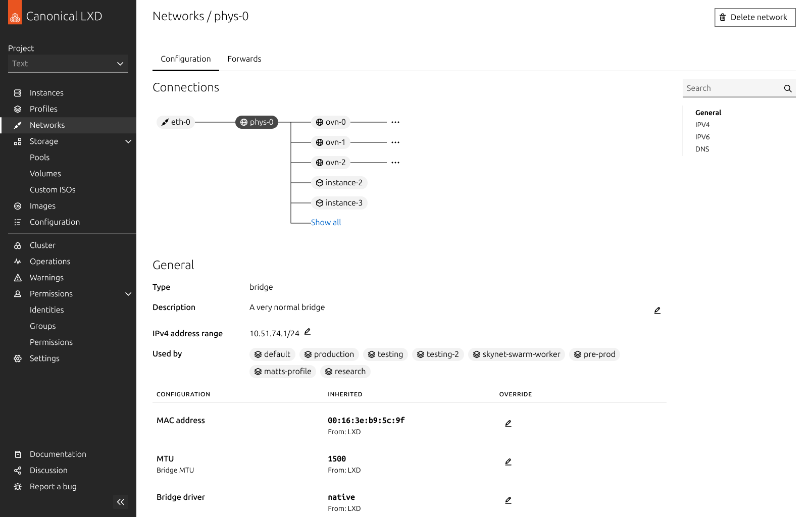

+++
date = '2026-06-22'
draft = true
title = 'Visualizing networks in LXD'
blurb = "How do you design interfaces for technical experts when you don't understand the underlying technology?"
thumbnail = "figjam-ovn-diagram.png"
+++

As a designer for a company like Canonical, you often find yourself designing experiences around very complex technical concepts.

When I was a designer there, I was responsible for a product called LXD. LXD is a hypervisor for linux containers and virtual machines. It's been around for a long time, and until a couple years ago, was a CLI-only app. My job was to design LXD-UI, a web interface that allowed users to do everything they could do in the CLI. Because LXD is such a mature product, there was a lot of functionality to replicate, some of it quite advanced for people without an engineering background.

My background within the design team was kind of a hybrid between designer and engineer.

On the one hand, I had been a linux enthusiast for years before joining the company, and my first role at Canonical was as a technical support engineer, troubleshooting and solving real customers' problems across a variety of Canonical's products like Ubuntu and LXD. On the other hand, I hold a Master of Information with a focus in user experience design, and I worked as a freelance designer before joining Canonical. So I found my self helping designers with engineering questions just as much as I helped engineers with design questions.

In my opinion there are few topics in information technology that are as confusing to understand as networking. So when I needed to design a way to manage virtual networks in LXD-UI, it really tested my ability to act as an interpreter between engineers and designers.

## How to learn from engineers

In order to work on a feature like this, a designer needs to start by educating themself on the technology.

But asking engineers to explain how it works can be challenging. It's hard for experts to think about things from a novice perspective, because they take a lot of things for granted. It's easy for experts to assume that you know something you don't know, and for neither of you to realize that they're making that assumption. On the other hand, you as the novice lack the language to formulate questions that an expert can understand. If you don't know what something is called, it's hard to ask how it works.

I ran into this problem right away while onboarding myself for this project. The strategy I adopted was to get a bunch of engineers in a room and just start drawing a diagram according to how I currently understood the system. This was scary, because it meant being wrong in front of a bunch of smart people. I thought I would draw the whole diagram before asking if I missed anything, but to my delight, I didn't make it very far before an engineer jumped out of his seat to correct me. [Cunningham's Law](https://meta.wikimedia.org/wiki/Cunningham%27s_Law), it turns out, is as accurate in real life as it is on the internet.

I love drawing a diagram because it allows you to express what you think you know without relying on technical language you don't have yet. It signals to the expert what level of understanding you have, revealing gaps in your knowledge by omission, and it gives the expert a visual template that they can use to communicate the correct knowledge back to you.

### Diagramming networks in LXD

What I understood about virtual networking before the project was this:
- LXD runs on a piece of physical hardware (a server), and runs one or more virtual machines (VMs) or containers. Think of these like mini computers inside a computer. These VMs/containers need to be able to talk to each other, so they can work together on whatever tasks the user needs them for. They do this by communicating over a network (sort of like the internet, but way smaller).
- LXD can be deployed on more than one server, with VMs/containers working together as if they were all running on the same server. Together, a collection of servers like this is called a cluster.
- The network that lets the VMs/containers communicate *within* a server doesn't work *across* servers. We need a different kind of network to accomplish this, one which can span the whole cluster. This is called a virtual network, and the implimentation we use in LXD is called OVN, for Open Virtual Networking.

This is enough to explain what I do for work at Thanksgiving dinner. But it's not enough to make the actual UI. I couldn't put a button in my UI that said "connect the thing to the other thing". I needed to get in the weeds and learn what all the different pieces are, how they're labelled, how they relate to each other, and how it's all implemented.

After my discussion with the engineers, this is the diagram I arrived at. You don't need to understand exactly what's going on here. But the important part is that it gives specific names to all the parts that were vague and fuzzy to me before. Every detail in this diagram is an affirmative statement about what exactly connects to what in this whole framework.


  <figure>
    
    <figcaption>The paper diagram</figcaption>
  </figure>
  <figure>
    
    <figcaption>The polished diagram</figcaption>
  </figure>


## Using diagrams to communicate

Armed with my diagram, I started designing the network-management experience in LXD-UI. But design work is a team effort, and I regularly needed feedback and help from other designers on the team. But in order for them to give useful feedback, I needed to catch them up on everything I had learned.

This put me in the complete opposite position from the problem from earlier. I knew all the technical details of the project I was working on, while many of my fellow designers knew even less than what I knew when I started. But I had the advantage of the recent memory of not knowing all the things I needed to explain, along with a ready-made visualisation containing only the critical information that needed to be understood for the task at hand.


  <figure>
    
  </figure>
  <figure>
    
  </figure>
  <figure>
    
  </figure>
  <figure>
    
  </figure>
  <figure>
    
  </figure>
  <figure>
    
  </figure>


That same diagram that I created with help from the engineers ended up being so helpful in communicating how the networking works to me, that I ended up using a version of it in the final UI to communicate the same thing to the user:

The diagram under the "connections" header is essentially the same tree structure that I map in the diagram, except instead of mapping a bunch of made up examples, it maps the user's actual networks that exist in their system.

## Conclusion

Before I was a designer at Canonical, when I was still part of the support engineering team, there was an inside joke that whenever someone needed to explain something complicated, "Piper always says: 'just draw a picture'". I'm super proud of that reputation. Diagrams are fantastic tool for teaching and learning, that many people overlook and underutilize.

Designers often think very differently from engineers. On the design team, there was nothing unique about my instinct for drawing a picture whenever an explanation got complicated. But I find that a lot of people with humanities backgrounds are more challenged when it comes thinking in terms of abstract rules and systems, a mode that computer engineers are very comfortable in.

Personally, I've always loved both modes of thinking, and always looked for ways to make each mode augment the other.

